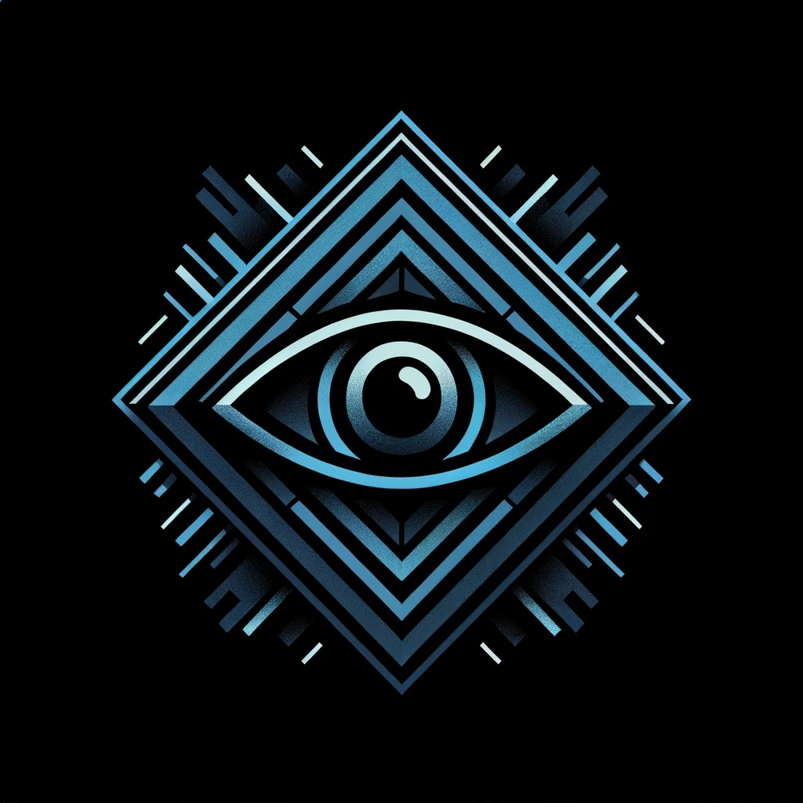

# Big Brother CTF

</img>
<p>1984 in 2024</p>

## Challenge Table

| Challenge | Learning Outcome |
|------|------------|
| [Pwn-1](bigbrother-ctf/pwn-1) 	 	 | Buffer Overflow (with simple constraint)   | 
| [Pwn-2](bigbrother-ctf/pwn-2) 		 | Format String (arbitrary read)    |
| [Pwn-3](bigbrother-ctf/pwn-3) 		 | Buffer Overflow (return-2-win) |
| [Re-1](bigbrother-ctf/re-1)   		 | Static Analysis (integer compares) |
| [Re-2](bigbrother-ctf/re-2)   		 | Dynamic Analysis (library tracing)  |
| [Re-3](bigbrother-ctf/re-3)   		 | Static Analysis (multiple compares)				|
| [Crypto-1](bigbrother-ctf/crypto-1)   | Cipher (Caesarian Shift 5)			    |
| [Crypto-2](cbigbrother-ctf/rypto-2)   | Chosen Plaintext Attack			 	|
| [Crypto-3](bigbrother-ctf/crypto-3)   | AES-ECB Encrypted Image		|
| [Forensics-1](bigbrother-ctf/forensics-1)   | Compressed File |   
| [Forensics-2](bigbrother-ctf/forensics-2)    | Memory Snapshot                         |
| [Forensics-3](bigbrother-ctf/forensics-3)   | Corrupted PNG Header                       | 
| [Web-1](bigbrother-ctf/web-1)			   | Command Injection | 
| [Web-2](bigbrother-ctf/web-2)			   | Admin Cookie | 
| [Web-3](bigbrother-ctf/web-1)			   | SQL Injection | 


## Docker Container

You can build the docker container locally using 

```
cd Docker
docker build -t bigbrother .
docker run -it bigbrother
```

Or you can pull a prebuilt image directly from DockerHub

```
docker run -it --name=bigbrother tjoconnor/bigbrother
```

## Referencess

- Our team used generative AI, specifically ChatGPT, to assist in the development of images and code for the competition. 
- The competition was supported by funds from a NSA Center of Academic Excellence GenCyber grant.
