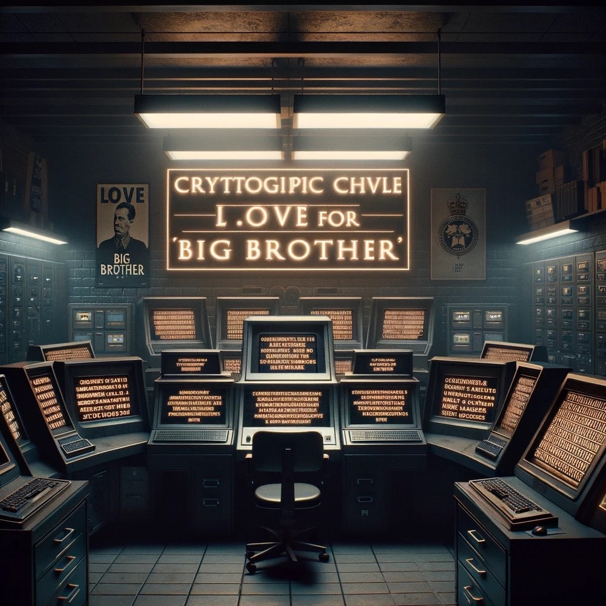
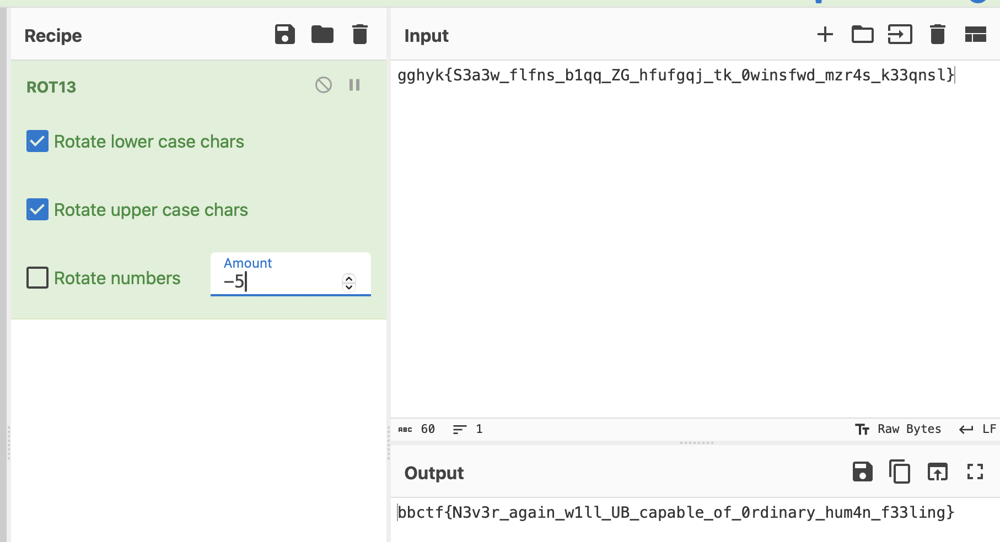

# crypto-1: twice as strong

</img>

## Prompt 

*There will be no love, except the love of Big Brother* Who needs **Caesar** when you have **Big Brother**? Our encryption algorithm is twice as strong. Strong like *Big Brother*. Smart like *Big Brother* Don't decrypt Big Brother's flag. We are watching you.

``gghyk{S3a3w_flfns_b1qq_ZG_hfufgqj_tk_0winsfwd_mzr4s_k33qnsl}``

## Solution

We know the flag begins with ``bbctf``. This means ``gghyk`` must go through a transformation to become ``bctf``. This is possible by subtracting -5 from each character. Thus, it is a [letter substitution ciper](https://en.wikipedia.org/wiki/ROT13). We can use [CyberChef](https://gchq.github.io) to do the rest.

</img>