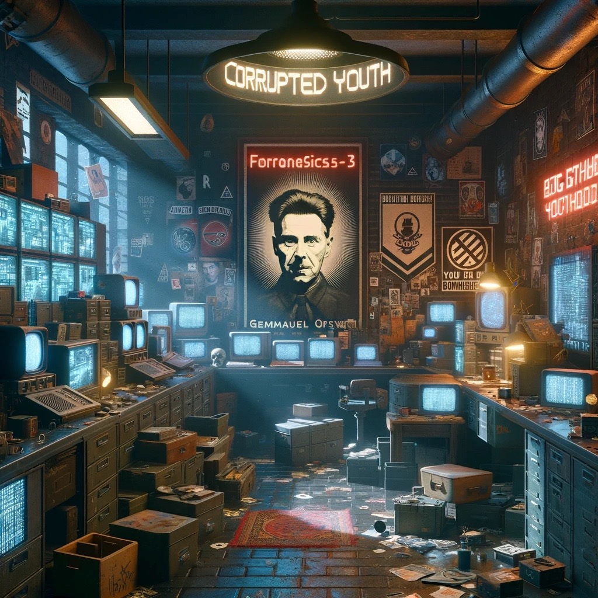

# forensics-3: corrupted youth

</img>

## Prompt

**Emmanuel Goldstein** and the Brotherhood corrupted **Big Brother's** favorite flag. These corrupted **YYYY**outh are envious of Big Brother and Oceania's long standing peace in the current war.  

## Solution

The PNG image has been corrupted. In the header you can see YYYY, which has replaced the corrupt values for the width and height of the image. You can examine the [PNG file format](http://www.libpng.org/pub/png/spec/1.2/PNG-Structure.html) or just use the obvious hint provided in the prompt.

```
hexdump -C flag.corrupted| head -2
00000000  89 50 4e 47 0d 0a 1a 0a  00 00 00 0d 49 48 44 52  |.PNG........IHDR|
00000010  00 00 59 59 00 00 be 59  59 06 00 00 00 1f 6c fe  |..YY...YY.....l.|
```

Luckily, the correct values have been preserved in the [exif](https://en.wikipedia.org/wiki/Exif) metadata.  

```
exiftool flag.corrupted| grep "Exif Image"
Exif Image Width                : 2788
Exif Image Height               : 1540
```

We can then use a [hexeditor](https://en.wikipedia.org/wiki/Hex_editor) to correct the values and repair the image. 
